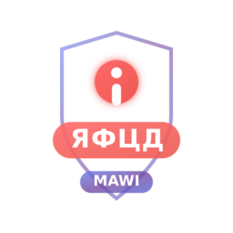

# MAWI LATIN TO CYRILLIC



**Advanced Latin to Cyrillic Text Converter & Cyrillic Character Detection Tool**

A powerful Chrome extension and web application that automatically detects Cyrillic characters in text fields and converts Latin text to Cyrillic with two specialized modes.

## 🌟 Features

### 🔍 Chrome Extension Features
- **Auto-Detection**: Automatically detects Cyrillic characters in any text input field
- **Visual Highlighting**: Highlights detected Cyrillic characters in red with pulsing animation
- **Real-time Warnings**: Instant alerts when Cyrillic characters are found
- **Link Protection**: Prevents opening URLs containing Cyrillic characters with security confirmation dialog
- **Universal Compatibility**: Works on any website or web application
- **Privacy-First**: All processing happens locally - no data collection
- **Toggleable Settings**: Control extension behavior with three main settings:
  - **Auto-Detection**: Enable/disable automatic Cyrillic character detection
  - **Highlighting**: Enable/disable visual highlighting of Cyrillic characters
  - **Warnings**: Enable/disable warning notifications and link protection
- **Security Features**: Advanced protection against potential phishing attempts using Cyrillic characters

### 🔄 Website Features
- **Normal Mode**: Converts all Latin characters to Cyrillic equivalents
- **Professional Mode**: Converts only visually similar characters
- **Instant Conversion**: Real-time text transformation
- **Copy & Paste**: Easy text manipulation and export
- **Responsive Design**: Works on desktop and mobile devices

## 🚀 Quick Start

### Option 1: Use the Web Application
1. Visit [https://mawi-officiel.github.io/MAWI_LATIN_TO_CYRILLIC/](https://mawi-officiel.github.io/MAWI_LATIN_TO_CYRILLIC/)
2. Enter your Latin text in the input field
3. Choose conversion mode (Normal or Professional)
4. Click "Convert to Cyrillic"
5. Copy the converted text

### Option 2: Install Chrome Extension
1. Download from [Chrome Web Store](https://chromewebstore.google.com/category/extensions)
2. Click "Add to Chrome"
3. The extension will automatically start detecting Cyrillic characters
4. Use the popup interface for text conversion

## 📦 Installation

### Chrome Extension Installation

#### From Chrome Web Store (Recommended)
1. Visit the [Chrome Web Store](https://chromewebstore.google.com/category/extensions)
2. Search for "MAWI LATIN TO CYRILLIC"
3. Click "Add to Chrome"
4. Confirm installation

#### Manual Installation (Developer Mode)
1. Clone this repository:
   ```bash
   git clone https://github.com/mawi-officiel/MAWI_TAP_AURA.git
   cd MAWI_LATIN_TO_CYRILLIC
   ```

2. Open Chrome and navigate to `chrome://extensions/`

3. Enable "Developer mode" (toggle in top-right corner)

4. Click "Load unpacked" and select the `extension` folder

5. The extension will be installed and ready to use

### Website Deployment

The website is automatically deployed via GitHub Pages. To deploy your own version:

1. Fork this repository
2. Enable GitHub Pages in repository settings
3. Set source to "Deploy from a branch" and select `main` branch
4. Your site will be available at `https://yourusername.github.io/MAWI_LATIN_TO_CYRILLIC/`

## 🎯 Usage

### Chrome Extension Usage

#### Automatic Detection
- The extension automatically scans all text input fields on web pages
- Cyrillic characters are highlighted in red with a pulsing animation
- Warning tooltips appear when Cyrillic characters are detected
- Input fields with Cyrillic characters get a red border

#### Manual Conversion
1. Click the extension icon in the Chrome toolbar
2. Enter Latin text in the input field
3. Select conversion mode:
   - **Normal**: Converts all Latin characters
   - **Professional**: Converts only visually similar characters
4. Click "Convert to Cyrillic"
5. Copy the result using the "Copy to Clipboard" button

#### Link Protection (Security Feature)
When warnings are enabled, the extension provides advanced security protection:
- **Automatic URL Scanning**: Monitors all link clicks for Cyrillic characters
- **Security Dialog**: Shows a warning dialog when clicking links containing Cyrillic characters
- **User Choice**: Provides two options:
  - **"لا أهتم" (Don't Care)**: Proceeds to open the potentially suspicious link
  - **"إغلاق" (Close)**: Cancels the navigation and keeps you safe
- **Phishing Protection**: Helps prevent access to potentially fraudulent websites using Cyrillic character spoofing

#### Settings Management
- **Auto-Detection**: Toggle automatic Cyrillic detection - turns the entire extension on/off
- **Highlighting**: Enable/disable visual highlighting of Cyrillic characters
- **Warnings**: Control warning notifications in input fields and link protection
- All settings are automatically saved and synchronized across your Chrome browser
- Changes take effect immediately without requiring a page refresh
- Settings persist across browser sessions

### Website Usage

1. **Input Text**: Enter your Latin text in the input field
2. **Choose Mode**:
   - **Normal Mode**: Comprehensive conversion of all Latin characters
   - **Professional Mode**: Converts only characters that look similar to Cyrillic
3. **Convert**: Click the "Convert to Cyrillic" button
4. **Copy**: Use the converted text as needed

## 🔧 Conversion Modes

### Normal Mode
Converts all Latin characters to their Cyrillic equivalents:
- `a` → `а`, `b` → `б`, `c` → `ц`, etc.
- Complete alphabet transformation
- Best for full text conversion

### Professional Mode
Converts only visually similar characters:
- `a` → `а`, `c` → `с`, `e` → `е`, `o` → `о`, `p` → `р`, `x` → `х`
- Maintains readability while introducing Cyrillic characters
- Useful for creating mixed-script text

## 📁 Project Structure

```
MAWI_LATIN_TO_CYRILLIC/
├── index.html              # Main website
├── privacy-policy.html     # Privacy policy page
├── extension/              # Chrome extension files
│   ├── manifest.json       # Extension manifest (V3)
│   ├── content.js          # Content script for detection
│   ├── content.css         # Styling for highlights
│   ├── background.js       # Background service worker
│   ├── popup.html          # Extension popup interface
│   └── popup.js            # Popup functionality
├── icons/                  # Application icons
│   ├── icon.ico           # Windows icon
│   └── icon.png           # Web icon
├── README.md              # This file
├── LICENSE                # License information
├── CONTRIBUTING.md        # Contribution guidelines
└── CODE_OF_CONDUCT.md     # Community guidelines
```

## 🔒 Privacy & Security

- **No Data Collection**: The extension and website do not collect any personal data
- **Local Processing**: All text conversion happens on your device
- **No Network Requests**: No data is sent to external servers
- **Open Source**: Full transparency with publicly available code
- **Privacy Policy**: Detailed privacy information available [here](privacy-policy.html)

## 🌐 Links & Resources

- **Live Website**: [https://mawi-officiel.github.io/MAWI_LATIN_TO_CYRILLIC/](https://mawi-officiel.github.io/MAWI_LATIN_TO_CYRILLIC/)
- **Chrome Extension**: [Chrome Web Store](https://chromewebstore.google.com/category/extensions)
- **Source Code**: [GitHub Repository](https://github.com/mawi-officiel/MAWI_TAP_AURA)
- **Developer Article**: [Read More](https://www.mawiman.com/2025/08/mawi-latin-to-cyrillic.html)
- **Developer Website**: [https://www.mawiman.com/](https://www.mawiman.com/)

## 🛠️ Technical Details

### Technologies Used
- **Frontend**: HTML5, CSS3, JavaScript (ES6+)
- **Extension**: Chrome Extension Manifest V3
- **Styling**: CSS Grid, Flexbox, CSS Animations
- **Storage**: Chrome Storage API (for extension settings)
- **Deployment**: GitHub Pages

### Browser Compatibility
- **Chrome**: Full support (recommended)
- **Edge**: Full support
- **Firefox**: Website only (extension not compatible)
- **Safari**: Website only (extension not compatible)

### Performance
- **Lightweight**: Minimal resource usage
- **Fast Processing**: Real-time text conversion
- **Efficient Detection**: Optimized Cyrillic character recognition
- **Memory Friendly**: Low memory footprint

## 🤝 Contributing

Contributions are restricted and must follow our guidelines. Please read [CONTRIBUTING.md](CONTRIBUTING.md) for details on our code of conduct and the process for submitting pull requests.

## 📄 License

This project is proprietary software. All rights reserved © 2025 Ayoub Alarjani (MAWI MAN). See the [LICENSE](LICENSE) file for details.

## 👨‍💻 Developer

**Ayoub Alarjani (MAWI MAN)**
- Website: [https://www.mawiman.com/](https://www.mawiman.com/)
- GitHub: [@mawi-officiel](https://github.com/mawi-officiel)

## 🆘 Support

If you encounter any issues or have questions:

1. Check the [Privacy Policy](privacy-policy.html) for common questions
2. Visit the [developer website](https://www.mawiman.com/) for support
3. Review the source code for technical details

## 🔄 Version History

### v1.0.0 (January 2025)
- Initial release
- Chrome extension with auto-detection
- Web application with dual conversion modes
- Privacy-focused design
- Complete documentation

---

**Made with ❤️ by [MAWI MAN](https://www.mawiman.com/)**